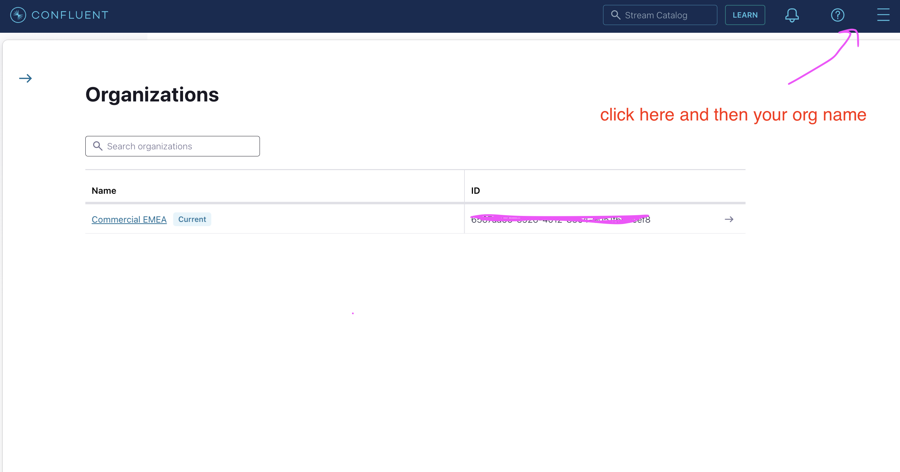
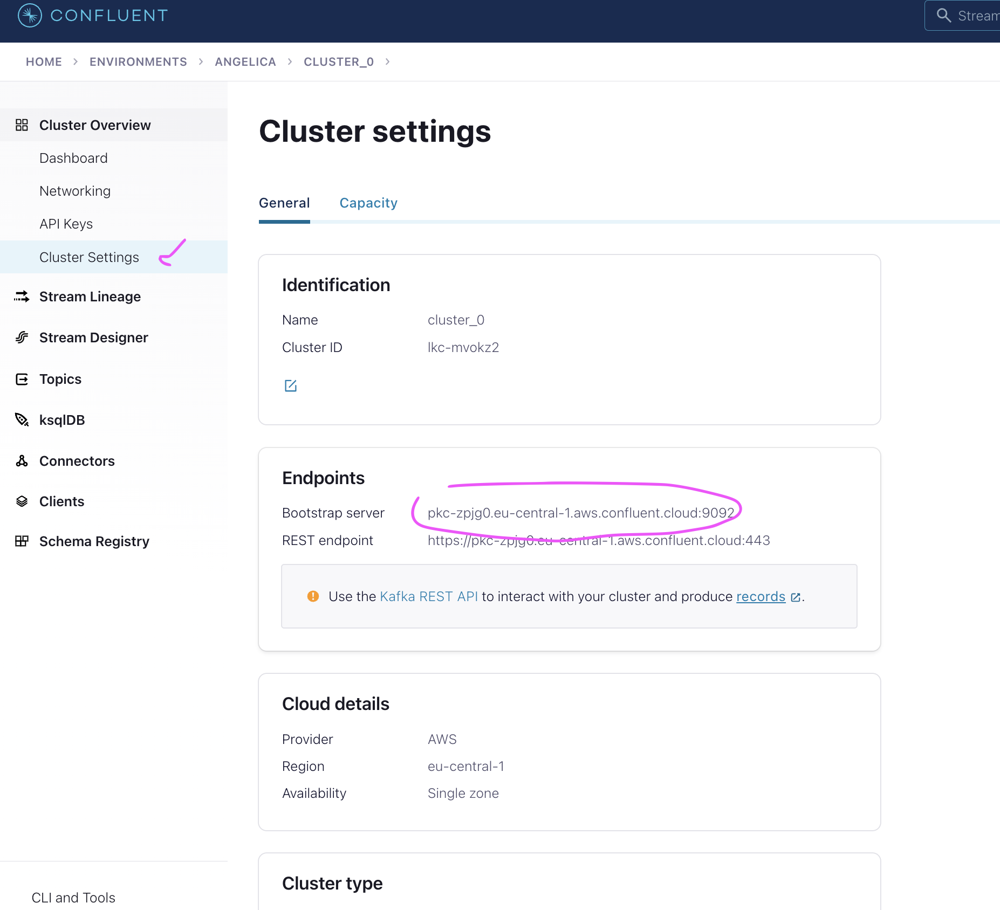

# confluent-cloud-hybrid-demo


First clone the git repo, and enter in the folder:

```
git clone https://github.com/angietd94/confluent-cloud-hybrid-demo.git
cd confluent-cloud-hybrid-demo

```

## Modify first the config.sh file with your values! <br>


###Guide: to find values in Confluent Cloud:


CLOUD_KEY="*****"<br>
CLOUD_SECRET="*****"<br>

<br>


ORG_ID="***-***-***-***-****"<br>
<br>

ENVID="env-****"<br>
<br>


export CLUSTERID="lkc-***"<br>
insidde the cluster information . Cluster > Cluster Settings.

#Either us, eu<br>
export GEO="eu"<br>
export REGION="eu-central-1"<br>
<br>
CLUSTERAPIKEY="*****"<br>
CLUSTERAPISECRET="******"<br>
<br>
<br>
<br>
#for example, aws or gcp<br>
CLOUDPROVIDER="aws"<br>
<br>
SR_API_KEY="****"<br>
SR_API_SECRET="****"<br>
SCHEMA_REGISTRY_URL="****+"<br>
The URL in the down-right side!
<br>
<br>
<br>


<br>
BOOTSTRAP_SERVERS="*****:****"<br>
<br>

<br>
<br>


## CLICKHOUSE DATA

export TOPIC="*****" <br>
export DATABASE_NAME="default"<br>
export DATABASE_PASSWORD="*****"<br>
export DATABASE_HOSTNAME="******"<br>
export CLICKHOUSE_HOSTNAME="****"<br>


############
##  Second part: Launching the script! <br>


then: <br>
```
chmod +x executable.sh 
chmod +x config_files.sh
```

Run:
```
./executable.sh 
```

It will ask for username and password for the account.
<br>

Check: 
<br>
http://localhost:8083/connector-plugins 
<br>
http://localhost:8083/connectors/ 
<br>
http://localhost:9021/clusters/

<br>

when all is up, modify first the config_files.sh file with your values for the connector and then run it. <br>
```
./config_files.sh
```


And the outcome would look like this!


Also some videos here that go through all the process:
https://drive.google.com/file/d/1xUpOMX-cFQDH5BVCfKHOc4IMn8uYmNxV/view
https://drive.google.com/file/d/1Zr-Nkpmpd2leGuErGQRAPJWxmiheWZTB/view?usp=sharing

